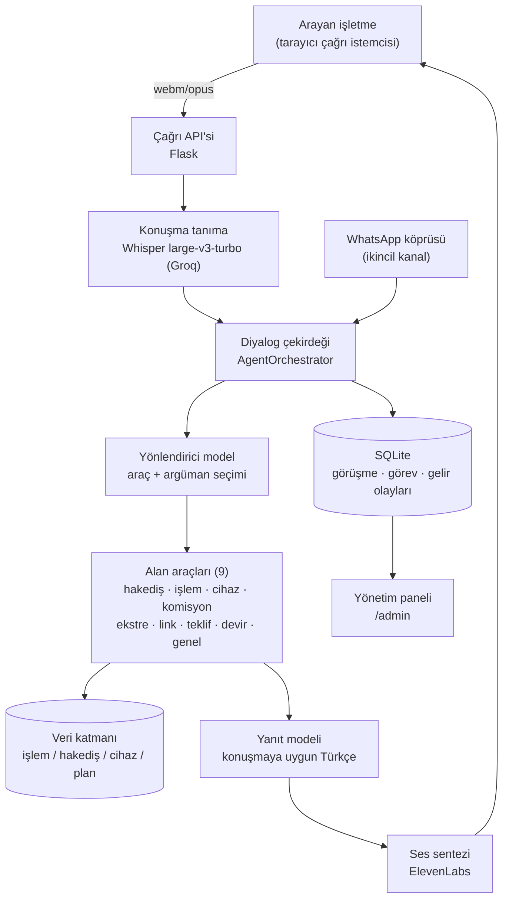

# Moka Sesli Asistan

**Ödeme kuruluşlarının işletme müşterileri için konuşma tabanlı yapay zekâ destek hattı.**

Moka Sesli Asistan (kod adı *Ada*), üye işyerlerinin telefonla ilettiği hakediş,
işlem, cihaz ve komisyon sorularını doğal Türkçe diyalog içinde, gerçek işlem
verisine dayanarak yanıtlayan; çözümün ardından satış fırsatlarını değerlendiren
ve işlem hacmi düşen müşterileri proaktif olarak arayabilen bir prototiptir.
Proje, **Moka United FinTech Hackathon: Hack the Idea** yarışması kapsamında
geliştirilmiştir.

---

## İçindekiler

1. [Problem Tanımı](#1-problem-tanımı)
2. [Çözüm Yaklaşımı](#2-çözüm-yaklaşımı)
3. [Sistem Mimarisi](#3-sistem-mimarisi)
4. [Diyalog Çekirdeği](#4-diyalog-çekirdeği)
5. [Konuşma İşleme Hattı](#5-konuşma-i̇şleme-hattı)
6. [Veri Modeli](#6-veri-modeli)
7. [Yönetim Paneli](#7-yönetim-paneli)
8. [Güvenlik Hususları](#8-güvenlik-hususları)
9. [Kurulum](#9-kurulum)
10. [Çalıştırma](#10-çalıştırma)
11. [Örnek Senaryolar](#11-örnek-senaryolar)
12. [Testler](#12-testler)
13. [Proje Yapısı](#13-proje-yapısı)
14. [Sınırlılıklar ve Yol Haritası](#14-sınırlılıklar-ve-yol-haritası)

---

## 1. Problem Tanımı

Ödeme sektöründe üye işyeri destek hatlarına gelen çağrıların önemli bir bölümü,
mevcut sistem verisiyle kısa sürede yanıtlanabilecek rutin sorgulardan oluşur:

- "Dünkü satışların parası ne zaman yatacak?"
- "Saat 16.40'ta 1.250 TL çektim ama hesapta göremiyorum."
- "POS cihazım açılmıyor, dükkânda müşteri bekliyor."
- "Bu ay komisyon neden bu kadar yüksek kesildi?"

Bu soruların tamamının cevabı işlem veritabanında hazırdır; buna rağmen arayan
işletme sahibi IVR menüleri ("1'e basın, 2'ye basın") ve bekleme kuyrukları
nedeniyle basit bir soru için dakikalarca beklemektedir. Sonuç, üç ayrı maliyet
kalemidir:

| Maliyet | Mekanizma |
| --- | --- |
| Operasyon gideri | Rutin çağrılar temsilci kapasitesini tüketir |
| Kaçan işlem hacmi | Cihazı arızalı işletme, sorun çözülene kadar satış yapamaz |
| Müşteri kaybı | Destek deneyiminden memnun olmayan işletme rakip sağlayıcıya geçer |

## 2. Çözüm Yaklaşımı

Ada, klasik IVR ağacının yerini alan tek bir konuşma arayüzü sunar. Tasarımın
üç ilkesi vardır:

**Veriye dayalı yanıt.** Asistanın söylediği her tutar, tarih ve durum bilgisi
araç katmanından (işlem, hakediş, cihaz kayıtları) gelir. Dil modelinin bu
alanları tahmin etmesine izin verilmez; veri yoksa asistan bunu açıkça söyler
veya görüşmeyi temsilciye devreder.

**Destekten gelire.** Sistem çağrıyı yalnızca kapatılacak bir maliyet olarak
görmez. Sorun çözüldükten sonra bağlama uygun tek bir teklif değerlendirilir:
cihazı arızalanan işletmeye geçici ödeme linki, cirosu büyüyen işletmeye daha
uygun komisyon planı, sosyal medyadan satış yapana sanal POS. Ayrıca işlem
hacmi düşen işletmeler panelde tespit edilir ve asistan bu müşterileri geri
kazanım teklifiyle proaktif olarak arayabilir. Kabul edilen teklifler panele
aylık hacim karşılığıyla ("kurtarılan hacim") işlenir.

**Ölçülü otonomi.** Öfke, dolandırıcılık şüphesi, ters ibraz itirazı, hukuki
ifadeler veya açık talep durumunda görüşme, o ana kadarki özetiyle birlikte
insan temsilciye aktarılır. Devirler panelde SLA sayaçlı bir kuyrukta izlenir.

## 3. Sistem Mimarisi



Çağrı istemcisi ses etkinliği algılama (VAD) ile çalışır: kullanıcı tuşa
basmadan konuşur, konuşma bittiğinde kayıt otomatik gönderilir; asistan
konuşurken söze girilirse ses kesilir ve dinlemeye dönülür (barge-in).
Arayanın kimliği, çağrı merkezlerindeki CTI yaklaşımına benzer biçimde hat
üzerinden belirlenir; asistan kimlik bilgisini yeniden sormaz.

Ölçümlerde uçtan uca tur süresi — konuşma tanıma, iki model çağrısı ve ses
sentezi dâhil — ortalama **2–3 saniye** aralığındadır.

## 4. Diyalog Çekirdeği

Çekirdek, her kullanıcı ifadesini iki aşamada işler:

1. **Yönlendirme.** Hafif bir model, ifadeyi ve görüşme bağlamını
   değerlendirerek çağrılacak aracı ve argümanlarını JSON olarak üretir. Aynı
   çağrıda "müşteri kartı" adı verilen yapısal hafıza güncellenir: güncel
   sorun, anılan tutar ve tarih, ruh hâli, olası satış fırsatı. Kart, sonraki
   turlarda her iki modele de otoriter bağlam olarak sunulur.
2. **Yanıt üretimi.** Araç sonuçları yapısal bir bağlam nesnesine yazılır ve
   daha güçlü bir model bu bağlamdan, sesli okumaya uygun kısa Türkçe yanıtı
   üretir.

Dayanıklılık için üç kademe tanımlıdır: model sayısal argümanı metin olarak
döndürürse ("1.250") tür dönüşümü dispatch sınırında yapılır; herhangi bir araç
çalışması hata verirse çağrı sonlanmaz, asistan özür dileyip bilgiyi yeniden
ister; API anahtarı kota sınırına takılırsa yedek anahtara, o da yoksa yerel
modele düşülür.

## 5. Konuşma İşleme Hattı

| Aşama | Bileşen | Not |
| --- | --- | --- |
| Kayıt | MediaRecorder + RMS tabanlı VAD | Kayıt, eşik aşıldığı anda başlar; kısa gürültüler yerel olarak elenir |
| Tanıma | Whisper large-v3-turbo (Groq) | Alan sözlüğü istem olarak verilir: "Ada", "hakediş", "POS" gibi terimler doğru çözülür; yerel Whisper yedektir |
| Üretim | Yönlendirici + yanıt modeli | Ayrı modeller, ayrı hız/kota profilleri |
| Sentez | ElevenLabs düşük gecikmeli model | Ses, katalogdan çağrı başına seçilebilir; varsayılan panelden yönetilir |

Yanıtlar "kulak için" son işlemden geçer: maskeli IBAN'lar "sonu 44 17 ile
biten IBAN" biçiminde okunur, adresler sesli okunmaz ("linki telefonunuza
gönderdim"), yüzdeler yazıyla ifade edilir, tutarlar doğal söyleyişe çevrilir
("bin 250 lira").

## 6. Veri Modeli

Prototip, gerçek ödeme altyapısını temsil eden bir örnek veri kümesiyle
çalışır ve araçların her biri gerçek sistemde tek bir servis uç noktasına
karşılık gelecek biçimde tanımlanmıştır.

| Küme | İçerik |
| --- | --- |
| merchants | 18 üye işyeri: sektör, ürünler, komisyon planı, altı aylık ciro serisi |
| transactions | İşlem kayıtları: tutar, komisyon, kart son dört hane, durum, hakediş grubu |
| settlements | Hakediş grupları: brüt/net tutar, ödeme zamanı, durum |
| pos_devices | Terminal envanteri: model, durum, son bağlantı |
| commission_plans | Plan tanımları ve geri kazanım kampanyası |
| support_kb | Arıza giderme adımları ve sık sorulan işlemler |

Kayıtlardaki tarihler göreli belirteçlerle tutulur ve yükleme sırasında güncel
tarihe çözülür; aylık ciro serileri de çalışma anında içinde bulunulan aya
sabitlenir. Böylece gösterim verisi zamanla geçerliliğini yitirmez.

## 7. Yönetim Paneli

Panel, klasik bir operasyon konsolu olarak tasarlanmıştır; açık ve koyu tema
desteği vardır.

- **Komuta Merkezi:** günlük çağrı sayısı, insana devredilmeden çözülen
  görüşme oranı, temsilci devirleri ve kurtarılan hacim göstergesi; çağrı
  hacmi ve saatlik yoğunluk grafikleri.
- **Uyuyan İşletmeler:** son ay cirosu önceki üç ayın ortalamasının %30'unun
  altına düşen müşterilerin listesi; her satırdan tek adımla proaktif arama
  başlatılabilir, kazanılan müşteriler işaretlenir.
- **Handoff Kuyruğu:** insan bekleyen görüşmeler, bekleme süresi sayaçları ve
  görüşme özetleriyle.
- **Konuşmalar / Görevler / Analitik:** görüşme dökümleri (her yanıtın hangi
  araçla üretildiği görülebilir), otomatik açılan servis kayıtları ve takip
  görevleri, dönüşüm hunisi ile araç kullanım dağılımı.
- **Ayarlar:** devir yapılacak temsilci bilgileri ve asistanın varsayılan
  sesi (ön dinleme ile).

## 8. Güvenlik Hususları

- Arayan tam kart numarası okumaya başlarsa asistan konuşmayı keserek yalnızca
  son dört hanenin yeterli olduğunu belirtir; kart verisi hiçbir katmanda
  açık biçimde tutulmaz.
- Tutar ve tarih bilgileri yalnızca araç katmanından gelir; arayüzde her
  yanıtın kaynağı (kullanılan araç) izlenebilir.
- Panel, parola tanımlandığında HTTP Basic Auth ile korunur; koruma sesli
  arama istemcisini de kapsar. WhatsApp köprüsü istek imzalama için ayrı bir
  jetonla kilitlenebilir.
- API anahtarları depoya dâhil edilmez; tamamı ortam değişkenleriyle sağlanır.

## 9. Kurulum

Gereksinimler: Python 3.12+, Groq API anahtarı (ücretsiz katman yeterlidir),
ElevenLabs API anahtarı.

```bash
git clone https://github.com/demiraay/moka-sesli-asistan.git
cd moka-sesli-asistan

python3 -m venv .venv
.venv/bin/pip install -r requirements.txt

cp .env.example .env   # ve asagidaki alanlari doldurun
```

| Değişken | Açıklama |
| --- | --- |
| `GROQ_API_KEY` | Dil modelleri ve konuşma tanıma |
| `GROQ_API_KEY_FALLBACK` | İsteğe bağlı yedek anahtar (kota sigortası) |
| `ELEVENLABS_API_KEY` | Ses sentezi |
| `ELEVENLABS_VOICE_ID` | Varsayılan ses; panelden de değiştirilebilir |
| `ADMIN_PASSWORD` | Doldurulursa panel ve çağrı ekranı parola ister |

İsteğe bağlı: çevrimdışı konuşma tanıma yedeği için `openai-whisper`
(ffmpeg gerektirir), WhatsApp kanalı için `whatsapp_mesaj_bot` altında
`npm install`.

## 10. Çalıştırma

```bash
.venv/bin/python server.py
```

Komut, yönetim panelini (5050) ve WhatsApp köprüsünü (5051) başlatır; Node
bağımlılıkları kuruluysa WhatsApp istemcisi de devreye alınır, değilse atlanır.

| Adres | İçerik |
| --- | --- |
| `http://127.0.0.1:5050/call` | Sesli görüşme istemcisi |
| `http://127.0.0.1:5050/admin` | Yönetim paneli |
| `http://127.0.0.1:5050/admin/outbound` | Proaktif arama listesi |

Gösterim öncesi veritabanını örnek kayıtlarla sıfırlamak için:

```bash
.venv/bin/python scripts/reset_demo.py --seed
```

## 11. Örnek Senaryolar

| Senaryo | Akış |
| --- | --- |
| Hakediş sorgusu | "Param ne zaman yatacak?" → son hakediş grubunun net tutarı ve ödeme zamanı, veriden |
| Kayıp işlem | "Dün 1.250 TL çektim, göremiyorum" → işlem bulunur, bağlı olduğu hakediş grubu ve ödeme tarihi açıklanır |
| Cihaz arızası | Arıza adımları tek tek denetilir; çözülmezse servis kaydı açılır ve satış kaybını önlemek için ödeme linki önerilir |
| Komisyon itirazı | Plan ve ay özeti veriyle açıklanır; ciro büyümüşse daha uygun plana geçiş önerilir |
| Devir | "Yeter artık, şikâyet edeceğim" → görüşme özetiyle temsilci kuyruğuna düşer |
| Proaktif arama | Panelden başlatılır; asistan ilk sözü alır, ayrılma nedenini öğrenir, geri kazanım teklifini sunar; kabul panele hacim karşılığıyla işlenir |

## 12. Testler

```bash
.venv/bin/python -m pytest tests/
```

Test kümesi 94 adettir; veri katmanı, senaryo bazlı araç yönlendirmesi, çağrı
API'si, WhatsApp köprüsü ve dil işleme katmanı, model çağrıları taklit
edilerek deterministik biçimde doğrulanır.

## 13. Proje Yapısı

```
core/            Diyalog çekirdeği, araçlar, veri erişimi, konuşma işleme
admin_panel/     Yönetim paneli ve çağrı istemcisi (Flask + şablonlar)
whatsapp/        WhatsApp köprü servisi (ikincil kanal)
whatsapp_mesaj_bot/  Node tabanlı WhatsApp Web istemcisi
data/            Örnek veri kümesi (JSON)
scripts/         Çalıştırma ve gösterim yardımcıları
tests/           Test kümesi
```

## 14. Sınırlılıklar ve Yol Haritası

| Alan | Mevcut durum | Planlanan |
| --- | --- | --- |
| Telefon erişimi | Tarayıcı tabanlı istemci | SIP/PSTN entegrasyonu; çağrı API'si taşıma katmanından bağımsız tasarlandığından geçiş yalnızca istemciyi etkiler |
| Kimlik doğrulama | Hat kimliği varsayımı | Ses biyometrisi veya tek kullanımlık kod |
| Konuşma akışı | Sıra tabanlı (~2–3 sn/tur) | Akış tabanlı tanıma ve sentez ile algılanan gecikmenin düşürülmesi |
| Veri kaynağı | Örnek kayıtlar | Araç arayüzleriyle bire bir eşleşen gerçek servis entegrasyonu |
