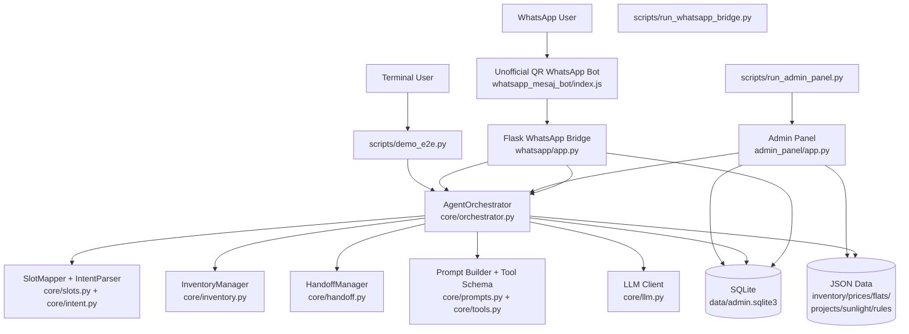
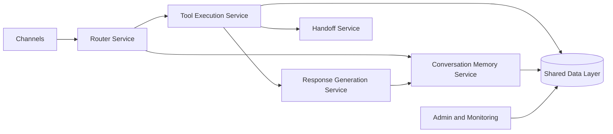

# Technical Architecture

## High-Level Diagram

## Runtime Layers

### 1. Channel layer

- terminal demo input comes through `scripts/demo_e2e.py`
- WhatsApp demo input comes through `whatsapp_mesaj_bot/index.js`
- Flask bridge normalizes inbound messaging traffic at `whatsapp/app.py`

### 2. Application layer

- `core/orchestrator.py` is the central coordinator
- it builds router prompts, selects tools, updates memory, formats responses, and writes notes

### 3. Domain/data layer

- listing and pricing truth live in `data/*.json`
- conversation history and AI notes live in SQLite via `core/admin_store.py`

### 4. Operations layer

- `admin_panel/app.py` provides listing edits, conversation review, and sales profile management

## Request Flow

### Terminal

1. user message enters `demo_e2e.py`
2. message is passed to `AgentOrchestrator.process_turn`
3. orchestrator parses intent/slots and asks router LLM for tool choice
4. orchestrator executes internal tool logic such as inventory search or handoff
5. final response is generated
6. conversation and AI notes are persisted

### WhatsApp Demo

1. WhatsApp user sends a message
2. QR bot receives it through `whatsapp-web.js`
3. QR bot forwards normalized payload to `/whatsapp/message`
4. Flask bridge calls `AgentOrchestrator.process_turn(..., channel="whatsapp")`
5. reply and follow-up actions are returned
6. QR bot sends the reply back to WhatsApp

## Current Architectural Characteristics

### Strengths

- simple enough to debug locally
- very little infrastructure required
- admin visibility exists
- multi-channel support already started

### Constraints

- orchestrator is a large god-object
- data is split between JSON files and SQLite
- the WhatsApp demo path is unofficial and session-dependent
- startup depends on manually launching multiple processes

## Suggested Future Shape

This target shape would reduce coupling and make new channels easier to add.
